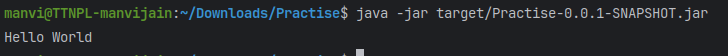

# Sample Maven Project

This is a sample Maven project that demonstrates:

- Adding dependencies and their repositories.
- Using Gson for JSON parsing.
- Adding a custom repository (JitPack).
- Including three dependencies with different scopes:
  - **Runtime**
  - **Compile**
  - **Test**
- Using Maven JAR plugins to make the JAR executable.

## Getting Started

To build and run this project, use the following commands:

```sh
mvn clean package
java -jar target/Practise-0.0.1-SNAPSHOT.jar
```


## Dependencies Used

- **Gson** (for JSON parsing)
- **Custom repository:** JitPack
- **Different scope dependencies**

## JAR Plugin Configuration

This project is configured to generate an executable JAR file using the Maven JAR plugin.
